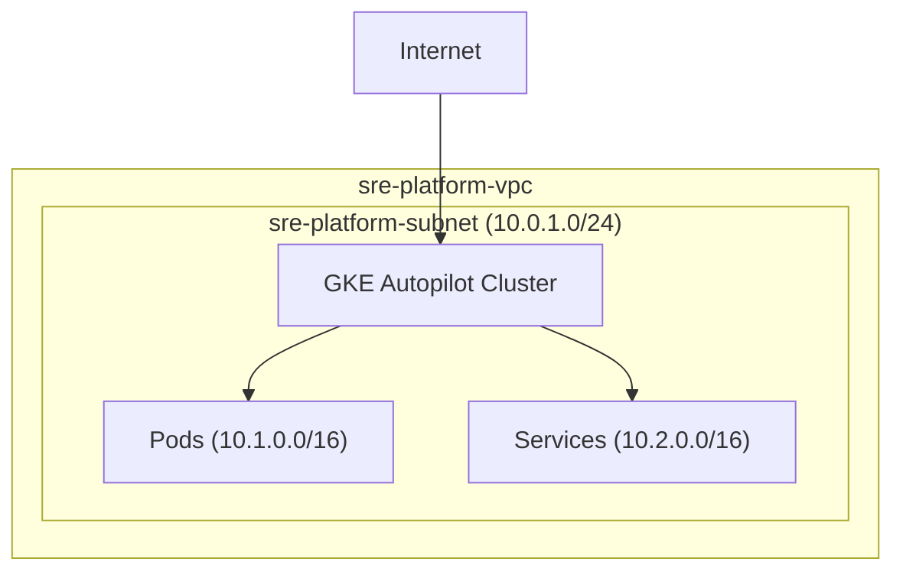
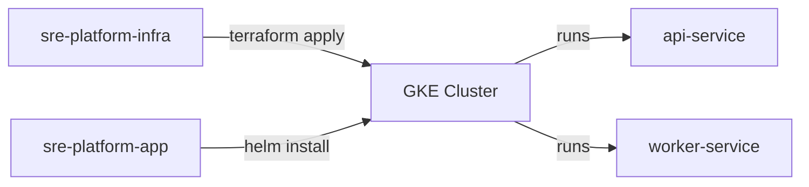

# SRE Platform Infrastructure

> **Production-Grade Kubernetes Infrastructure on Google Cloud Platform**

[](https://www.terraform.io/)
[](https://cloud.google.com/kubernetes-engine)
[](LICENSE)

---

## 📖 Table of Contents

- [Overview](#-overview)
- [Architecture](#-architecture)
- [What Gets Provisioned](#-what-gets-provisioned)
- [Technology Decisions](#-technology-decisions)
- [Getting Started](#-getting-started)
- [Configuration](#-configuration)
- [Project Structure](#-project-structure)
- [Cost Considerations](#-cost-considerations)
- [Related Repositories](#-related-repositories)

---

## 🎯 Overview

This repository contains **Infrastructure as Code (IaC)** using Terraform to provision a production-grade Kubernetes platform on Google Cloud Platform. It is the foundation layer of the SRE Portfolio project.

### What This Enables

| Capability | Implementation |
|------------|----------------|
| **Container Orchestration** | GKE Autopilot cluster |
| **Network Isolation** | Custom VPC with dedicated subnets |
| **Scalability** | Auto-managed node pools |
| **State Management** | Remote Terraform state in GCS |
| **Reproducibility** | `terraform apply` → Full platform |

---

## 🏗️ Architecture

```
┌─────────────────────────────────────────────────────────────────────────┐
│                         GOOGLE CLOUD PLATFORM                            │
│                         Project: sre-portfolio                           │
│  ┌───────────────────────────────────────────────────────────────────┐  │
│  │                     VPC: sre-platform-vpc                          │  │
│  │  ┌─────────────────────────────────────────────────────────────┐  │  │
│  │  │              Subnet: sre-platform-subnet                     │  │  │
│  │  │                    10.0.1.0/24                               │  │  │
│  │  │  ┌─────────────────────────────────────────────────────────┐│  │  │
│  │  │  │            GKE Autopilot Cluster                        ││  │  │
│  │  │  │           sre-platform-cluster                          ││  │  │
│  │  │  │                                                         ││  │  │
│  │  │  │   ┌─────────────┐  ┌─────────────┐  ┌─────────────┐    ││  │  │
│  │  │  │   │ api-service │  │   worker    │  │    redis    │    ││  │  │
│  │  │  │   │    Pod      │  │    Pod      │  │    Pod      │    ││  │  │
│  │  │  │   └─────────────┘  └─────────────┘  └─────────────┘    ││  │  │
│  │  │  │                                                         ││  │  │
│  │  │  │   Pod CIDR: 10.1.0.0/16   Service CIDR: 10.2.0.0/16    ││  │  │
│  │  │  └─────────────────────────────────────────────────────────┘│  │  │
│  │  └─────────────────────────────────────────────────────────────┘  │  │
│  └───────────────────────────────────────────────────────────────────┘  │
│                                                                          │
│  ┌─────────────────┐                                                    │
│  │   GCS Bucket    │  ← Terraform State                                 │
│  └─────────────────┘                                                    │
└─────────────────────────────────────────────────────────────────────────┘
```

### Network Design



---

## 📦 What Gets Provisioned

| Resource | Name | Details |
|----------|------|---------|
| **VPC Network** | `sre-platform-vpc` | Custom VPC with no auto-created subnets |
| **Subnet** | `sre-platform-subnet` | Primary: `10.0.1.0/24` in `asia-south1` |
| **Pod IP Range** | `gke-pods-range` | Secondary: `10.1.0.0/16` (~65k pods) |
| **Service IP Range** | `gke-services-range` | Secondary: `10.2.0.0/16` (~65k services) |
| **GKE Cluster** | `sre-platform-cluster` | Autopilot mode, regional |

---

## 🛠️ Technology Decisions

### Why GKE Autopilot?

| Feature | Benefit |
|---------|---------|
| **No Node Management** | Google manages nodes, OS patching, scaling |
| **Pay-per-Pod** | Only pay for running pods, not idle nodes |
| **Built-in Best Practices** | Security hardening, resource optimization |
| **Reduced Ops Burden** | Focus on apps, not infrastructure |

> **SRE Principle**: Autopilot implements Google's internal SRE practices automatically, reducing toil.

### Why asia-south1 (Mumbai)?

- **Low Latency**: Closest GCP region to India
- **Cost Effective**: Competitive pricing for South Asia
- **Compliance**: Data residency within India if needed

### Why Custom VPC?

- **IP Control**: Predictable CIDR ranges for peering/VPN
- **Security**: No default firewall rules
- **Scalability**: Pre-allocated pod/service ranges

### Why Remote State in GCS?

- **Collaboration**: Multiple engineers can apply changes
- **State Locking**: Prevents concurrent modifications
- **Versioning**: GCS versioning for state history
- **Security**: Encrypted at rest

---

## 🚀 Getting Started

### Prerequisites

- [Terraform](https://www.terraform.io/downloads.html) v1.0+
- [Google Cloud SDK](https://cloud.google.com/sdk/docs/install) (`gcloud`)
- GCP Project with billing enabled
- Permissions: `roles/compute.networkAdmin`, `roles/container.admin`

### Quick Start

```bash
# 1. Clone the repository
git clone https://github.com/Sanjeevliv/sre-platform-infra.git
cd sre-platform-infra

# 2. Authenticate with GCP
gcloud auth application-default login
gcloud config set project sre-portfolio

# 3. Initialize Terraform
terraform init

# 4. Review the plan
terraform plan

# 5. Provision infrastructure
terraform apply

# 6. Connect to the cluster
gcloud container clusters get-credentials sre-platform-cluster \
  --region asia-south1 \
  --project sre-portfolio

# 7. Verify connection
kubectl get nodes
```

### Tear Down

```bash
# Destroy all resources (USE WITH CAUTION)
terraform destroy
```

---

## ⚙️ Configuration

### Input Variables

| Variable | Description | Default |
|----------|-------------|---------|
| `project_id` | GCP project ID | `sre-portfolio` |
| `region` | GCP region for resources | `asia-south1` |

### Outputs

| Output | Description |
|--------|-------------|
| `cluster_name` | Name of the GKE cluster |
| `cluster_endpoint` | API server endpoint (for kubectl) |

### Customization

```bash
# Override variables at apply time
terraform apply -var="project_id=my-project" -var="region=us-central1"
```

---

## 📁 Project Structure

```
sre-platform-infra/
├── main.tf           # Backend configuration (GCS state)
├── provider.tf       # Google provider setup
├── variables.tf      # Input variable definitions
├── network.tf        # VPC and subnet resources
├── gke.tf            # GKE Autopilot cluster + outputs
├── _SRE.txt          # Master SRE project plan
└── README.md         # This documentation
```

### File Responsibilities

| File | Purpose |
|------|---------|
| `main.tf` | Remote backend in GCS bucket |
| `provider.tf` | Google provider version constraints |
| `variables.tf` | Parameterized inputs for reusability |
| `network.tf` | VPC, subnet, secondary IP ranges |
| `gke.tf` | Cluster definition with Autopilot |

---

## 💰 Cost Considerations

### GKE Autopilot Pricing

| Component | Cost |
|-----------|------|
| **Cluster Management Fee** | ~$0.10/hour (~$72/month) |
| **Pod Resources** | Pay only for requested CPU/memory |
| **Network Egress** | Standard GCP rates |

### Cost Optimization Tips

1. **Use Spot Pods** — Add `cloud.google.com/gke-spot: "true"` for 60-90% savings
2. **Right-size Requests** — Autopilot bills based on resource requests
3. **Delete When Idle** — `terraform destroy` when not testing
4. **Set Budget Alerts** — GCP Budget notifications for spend tracking

> **Current Setup**: Budget alerts configured for cost visibility.

---

## 🔗 Related Repositories

| Repository | Description |
|------------|-------------|
| [sre-platform-app](https://github.com/Sanjeevliv/sre-platform-app) | Application layer (Go microservices, Helm charts) |

### Deployment Flow



---

## 📚 References

- [GKE Autopilot Documentation](https://cloud.google.com/kubernetes-engine/docs/concepts/autopilot-overview)
- [Terraform GCP Provider](https://registry.terraform.io/providers/hashicorp/google/latest/docs)
- [Google SRE Book](https://sre.google/sre-book/table-of-contents/)

---

## 📄 License

MIT License - See [LICENSE](LICENSE) for details.